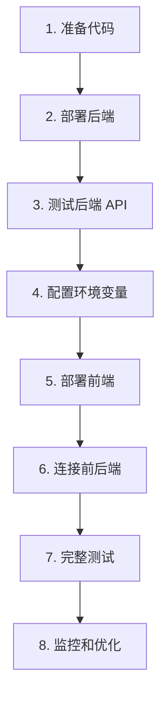

# 🚀 Decision Assistant 部署方案完整指南

> **项目架构：** 前后端分离 (React + FastAPI)  
> **更新时间：** 2025-10-14  
> **适用人群：** 所有开发者和部署人员

---

## 📋 目录

1. [快速选择](#快速选择)
2. [方案对比](#方案对比)
3. [推荐方案详细步骤](#推荐方案详细步骤)
4. [配置文件准备](#配置文件准备)
5. [常见问题](#常见问题)

---

## 🎯 快速选择

根据您的需求快速选择最适合的方案：

| 使用场景 | 推荐方案 | 月成本 | 点击跳转 |
|---------|---------|--------|---------|
| 🎓 学习/测试/个人项目 | **Vercel + Render** | 免费 | [查看](#方案1vercel--render-免费) |
| 💼 小型商业项目 | **Vercel + Railway** | $5-10 | [查看](#方案2vercel--railway-付费稳定) |
| 🏢 中大型项目 | **Cloudflare Pages + Fly.io** | $3-15 | [查看](#方案3cloudflare-pages--flyio-高性价比) |
| 🌏 国内访问优化 | **Netlify + Railway + CDN** | $10-20 | [查看](#方案4国内优化方案) |
| 🐳 完全自托管 | **Docker + VPS** | $5-20 | [查看](#方案5docker--vps-完全控制) |

---

## 📊 方案对比

### 前端部署平台对比

| 平台 | 免费额度 | 优点 | 缺点 | 国内访问 |
|-----|---------|------|------|---------|
| **Vercel** | 100 GB/月 | 部署简单，GitHub集成好 | 国内速度一般 | ⭐⭐⭐ |
| **Netlify** | 100 GB/月 | 功能丰富，表单处理 | 构建时间限制 | ⭐⭐⭐ |
| **Cloudflare Pages** | 无限流量 | 全球CDN，速度快 | 配置稍复杂 | ⭐⭐⭐⭐⭐ |
| **GitHub Pages** | 免费 | 简单稳定 | 仅静态，需后端API | ⭐⭐ |

### 后端部署平台对比

| 平台 | 免费额度 | 优点 | 缺点 | 稳定性 |
|-----|---------|------|------|--------|
| **Render** | 750小时/月 | 免费，配置简单 | 15分钟休眠，冷启动慢 | ⭐⭐⭐ |
| **Railway** | $5试用 | 无休眠，速度快 | 需要付费($5/月起) | ⭐⭐⭐⭐⭐ |
| **Fly.io** | 3个应用免费 | 全球部署，边缘计算 | 配置复杂 | ⭐⭐⭐⭐ |
| **Heroku** | 停止免费计划 | 成熟稳定 | 最低$7/月 | ⭐⭐⭐⭐ |
| **阿里云/腾讯云** | 新用户优惠 | 国内速度快 | 需备案，配置复杂 | ⭐⭐⭐⭐⭐ |

---

## 🌟 推荐方案详细步骤

### 方案1：Vercel + Render (免费)

**最适合：** 学习、测试、个人项目  
**总成本：** 免费  
**部署难度：** ⭐⭐ (简单)

#### 步骤 1.1：部署前端到 Vercel

**方式 A：使用 Vercel CLI（推荐）**

```bash
# 1. 安装 Vercel CLI
npm install -g vercel

# 2. 进入前端目录
cd frontend

# 3. 登录 Vercel
vercel login

# 4. 部署到生产环境
vercel --prod
```

**方式 B：使用 GitHub 集成**

1. 访问 [vercel.com](https://vercel.com)
2. 点击 "Import Project"
3. 选择您的 GitHub 仓库
4. 配置项目：
   ```
   Framework Preset: Create React App
   Root Directory: frontend
   Build Command: npm run build
   Output Directory: build
   ```
5. 点击 "Deploy"

#### 步骤 1.2：部署后端到 Render

1. **注册并登录 Render**
   - 访问 [render.com](https://render.com)
   - 使用 GitHub 账号登录

2. **创建 Web Service**
   - 点击 "New +" → "Web Service"
   - 选择您的 GitHub 仓库
   - 配置如下：

   ```yaml
   Name: decision-assistant-backend
   Region: Oregon (或选择最近的区域)
   Branch: main
   
   Root Directory: backend
   Runtime: Python 3
   Build Command: pip install -r requirements.txt
   Start Command: uvicorn app.main:app --host 0.0.0.0 --port $PORT
   
   Instance Type: Free
   ```

3. **配置环境变量**

   在 Render 的 "Environment" 设置中添加：

   ```bash
   DEEPSEEK_API_KEY=sk-你的DeepSeek密钥
   ALLOWED_ORIGINS=["https://你的vercel域名.vercel.app"]
   ```

4. **等待部署完成**（约3-5分钟）

   部署成功后，复制您的后端 URL：
   ```
   https://decision-assistant-backend.onrender.com
   ```

#### 步骤 1.3：连接前端和后端

1. **在 Vercel 添加环境变量**

   - 进入 Vercel 项目 → Settings → Environment Variables
   - 添加：
     ```
     Name: REACT_APP_API_URL
     Value: https://你的后端.onrender.com
     Environments: Production, Preview, Development (全选)
     ```

2. **更新后端 CORS 配置**

   编辑 `backend/app/core/config.py`：

   ```python
   allowed_origins: List[str] = [
       "http://localhost:3000",
       "https://你的项目名.vercel.app",
       "https://*.vercel.app",  # 允许所有 Vercel 预览部署
   ]
   ```

3. **重新部署**

   - 推送代码到 GitHub，Render 会自动部署
   - 在 Vercel 点击 "Redeploy"

#### 步骤 1.4：测试部署

```bash
# 测试后端
curl https://你的后端.onrender.com/health

# 应该返回：
{"status":"ok"}

# 测试前端
# 访问你的 Vercel URL，测试功能
```

---

### 方案2：Vercel + Railway (付费，稳定)

**最适合：** 需要稳定性的商业项目  
**总成本：** $5-10/月  
**部署难度：** ⭐⭐ (简单)

#### 步骤 2.1：部署前端到 Vercel

同 [方案1 步骤1.1](#步骤-11部署前端到-vercel)

#### 步骤 2.2：部署后端到 Railway

1. **注册 Railway**
   - 访问 [railway.app](https://railway.app)
   - 使用 GitHub 账号登录
   - 绑定支付方式（获得 $5 试用额度）

2. **创建新项目**
   - 点击 "New Project"
   - 选择 "Deploy from GitHub repo"
   - 选择您的仓库

3. **配置服务**

   Railway 会自动检测，但需要调整：

   - 点击项目 → Settings
   - **Root Directory**: `backend`
   - **Start Command**: `uvicorn app.main:app --host 0.0.0.0 --port $PORT`

4. **环境变量**

   在 Variables 标签添加：
   ```bash
   DEEPSEEK_API_KEY=sk-你的密钥
   PORT=8000
   ALLOWED_ORIGINS=["https://你的vercel域名.vercel.app"]
   ```

5. **生成域名**
   - 点击 Settings → Generate Domain
   - 复制生成的 URL

6. **连接前端**
   - 在 Vercel 添加环境变量 `REACT_APP_API_URL`
   - 值为 Railway 生成的 URL

**Railway 优势：**
- ✅ 无休眠，始终在线
- ✅ 冷启动快
- ✅ 自动扩展
- ✅ 内置 PostgreSQL 支持

---

### 方案3：Cloudflare Pages + Fly.io (高性价比)

**最适合：** 需要全球访问速度的项目  
**总成本：** $3-5/月（后端）+ 免费（前端）  
**部署难度：** ⭐⭐⭐ (中等)

#### 步骤 3.1：部署前端到 Cloudflare Pages

1. **准备工作**

   ```bash
   cd frontend
   npm run build
   ```

2. **使用 Wrangler CLI 部署**

   ```bash
   # 安装 Wrangler
   npm install -g wrangler

   # 登录 Cloudflare
   wrangler login

   # 部署
   wrangler pages deploy build
   ```

   或者使用 **GitHub 集成**：
   - 访问 Cloudflare Dashboard
   - Pages → Create a project
   - 连接 GitHub 仓库
   - 配置：
     ```
     Build command: cd frontend && npm run build
     Build output directory: frontend/build
     ```

#### 步骤 3.2：部署后端到 Fly.io

1. **安装 Fly CLI**

   Windows (PowerShell):
   ```powershell
   iwr https://fly.io/install.ps1 -useb | iex
   ```

   Mac/Linux:
   ```bash
   curl -L https://fly.io/install.sh | sh
   ```

2. **登录 Fly.io**

   ```bash
   fly auth login
   ```

3. **创建 fly.toml 配置**

   在 `backend/` 目录创建 `fly.toml`：

   ```toml
   app = "decision-assistant-backend"
   primary_region = "sin"  # 新加坡，或选择其他区域

   [build]
     dockerfile = "Dockerfile"

   [env]
     PORT = "8000"

   [http_service]
     internal_port = 8000
     force_https = true
     auto_stop_machines = true
     auto_start_machines = true
     min_machines_running = 0

   [[vm]]
     cpu_kind = "shared"
     cpus = 1
     memory_mb = 256
   ```

4. **部署**

   ```bash
   cd backend
   fly launch --no-deploy  # 创建应用
   fly secrets set DEEPSEEK_API_KEY=sk-你的密钥
   fly deploy  # 部署
   ```

5. **获取 URL**

   ```bash
   fly status
   ```

   URL 格式：`https://decision-assistant-backend.fly.dev`

#### 步骤 3.3：连接前端和后端

在 Cloudflare Pages 项目设置中添加环境变量：
```
REACT_APP_API_URL=https://你的应用.fly.dev
```

**优势：**
- ✅ Cloudflare 全球 CDN，国内外访问都快
- ✅ Fly.io 支持边缘部署
- ✅ 自动 HTTPS
- ✅ 成本低

---

### 方案4：国内优化方案

**最适合：** 主要服务国内用户的项目  
**总成本：** $10-20/月  
**部署难度：** ⭐⭐⭐⭐ (较复杂)

#### 架构设计

```
用户 → CDN (阿里云/腾讯云) → 前端 (Netlify/Vercel)
                              ↓
用户 → API 网关 → 后端 (腾讯云 Serverless/阿里云函数计算)
```

#### 选项 A：使用国内云服务商

1. **前端：阿里云 OSS + CDN**
   
   ```bash
   cd frontend
   npm run build
   
   # 使用阿里云 CLI 上传
   ossutil cp -r build/ oss://your-bucket/
   ```

2. **后端：阿里云函数计算**
   
   创建 `backend/s.yaml`：
   ```yaml
   edition: 1.0.0
   name: decision-assistant
   access: default
   
   services:
     api:
       component: fc
       props:
         region: cn-hangzhou
         service:
           name: decision-api
         function:
           name: main
           runtime: python3.9
           codeUri: ./
           handler: app.main.handler
           timeout: 60
           memorySize: 512
           environmentVariables:
             DEEPSEEK_API_KEY: ${env.DEEPSEEK_API_KEY}
         triggers:
           - name: httpTrigger
             type: http
             config:
               authType: anonymous
               methods:
                 - GET
                 - POST
   ```

   部署：
   ```bash
   s deploy
   ```

#### 选项 B：使用 Vercel + Railway + CDN

1. 前端部署到 Vercel（同方案1）
2. 后端部署到 Railway（同方案2）
3. 配置 CDN：
   - 使用又拍云、七牛云等
   - 缓存静态资源
   - 加速 API 请求

---

### 方案5：Docker + VPS (完全控制)

**最适合：** 需要完全控制的项目  
**总成本：** $5-20/月（VPS费用）  
**部署难度：** ⭐⭐⭐⭐⭐ (复杂)

#### 步骤 5.1：准备 VPS

推荐服务商：
- **国外：** DigitalOcean, Linode, Vultr
- **国内：** 阿里云轻量应用服务器, 腾讯云

#### 步骤 5.2：服务器配置

```bash
# 1. 连接到服务器
ssh root@your-server-ip

# 2. 安装 Docker
curl -fsSL https://get.docker.com | sh
sudo systemctl start docker
sudo systemctl enable docker

# 3. 安装 Docker Compose
sudo curl -L "https://github.com/docker/compose/releases/download/v2.20.0/docker-compose-$(uname -s)-$(uname -m)" -o /usr/local/bin/docker-compose
sudo chmod +x /usr/local/bin/docker-compose

# 4. 安装 Nginx
sudo apt update
sudo apt install nginx -y

# 5. 安装 Certbot（SSL证书）
sudo apt install certbot python3-certbot-nginx -y
```

#### 步骤 5.3：部署应用

1. **克隆代码**

   ```bash
   git clone https://github.com/your-username/decision-assistant.git
   cd decision-assistant
   ```

2. **创建环境变量文件**

   创建 `backend/.env`：
   ```bash
   DEEPSEEK_API_KEY=sk-你的密钥
   ALLOWED_ORIGINS=["https://你的域名.com"]
   ```

3. **构建并启动**

   ```bash
   docker-compose up -d
   ```

4. **配置 Nginx**

   创建 `/etc/nginx/sites-available/decision-assistant`：

   ```nginx
   server {
       listen 80;
       server_name 你的域名.com;

       # 前端
       location / {
           proxy_pass http://localhost:3000;
           proxy_http_version 1.1;
           proxy_set_header Upgrade $http_upgrade;
           proxy_set_header Connection 'upgrade';
           proxy_set_header Host $host;
           proxy_cache_bypass $http_upgrade;
       }

       # 后端 API
       location /api {
           proxy_pass http://localhost:8000;
           proxy_http_version 1.1;
           proxy_set_header Host $host;
           proxy_set_header X-Real-IP $remote_addr;
           proxy_set_header X-Forwarded-For $proxy_add_x_forwarded_for;
       }
   }
   ```

   启用配置：
   ```bash
   sudo ln -s /etc/nginx/sites-available/decision-assistant /etc/nginx/sites-enabled/
   sudo nginx -t
   sudo systemctl reload nginx
   ```

5. **配置 SSL**

   ```bash
   sudo certbot --nginx -d 你的域名.com
   ```

6. **设置自动更新**

   创建 `update.sh`：
   ```bash
   #!/bin/bash
   cd /root/decision-assistant
   git pull
   docker-compose down
   docker-compose up -d --build
   ```

   设置定时任务：
   ```bash
   chmod +x update.sh
   crontab -e
   # 添加：每天凌晨3点更新
   0 3 * * * /root/decision-assistant/update.sh >> /var/log/update.log 2>&1
   ```

---

## 🔧 配置文件准备

### 1. 更新前端 API 地址

编辑 `frontend/src/App.js`，使用环境变量：

```javascript
const API_URL = process.env.REACT_APP_API_URL || 'http://localhost:8000';
```

### 2. 更新后端 CORS

编辑 `backend/app/core/config.py`：

```python
import os

class Settings(BaseSettings):
    # ... 其他配置 ...
    
    allowed_origins: List[str] = [
        "http://localhost:3000",
        os.getenv("FRONTEND_URL", ""),
    ]
    
    # 或者从环境变量直接读取列表
    def __init__(self, **kwargs):
        super().__init__(**kwargs)
        if os.getenv("ALLOWED_ORIGINS"):
            import json
            self.allowed_origins = json.loads(os.getenv("ALLOWED_ORIGINS"))
```

### 3. 创建 Railway 配置文件（可选）

创建 `railway.json`：

```json
{
  "$schema": "https://railway.app/railway.schema.json",
  "build": {
    "builder": "NIXPACKS"
  },
  "deploy": {
    "startCommand": "cd backend && uvicorn app.main:app --host 0.0.0.0 --port $PORT",
    "restartPolicyType": "ON_FAILURE",
    "restartPolicyMaxRetries": 10
  }
}
```

### 4. 创建 Fly.io 配置文件

在 `backend/` 目录创建 `fly.toml`（见方案3）

### 5. 创建健康检查文件

确保 `backend/app/main.py` 有健康检查端点：

```python
@app.get("/health")
async def health_check():
    return {
        "status": "healthy",
        "service": "backend",
        "ai": "DeepSeek" if settings.deepseek_api_key else "Not configured"
    }
```

---

## ❓ 常见问题

### Q1: 如何选择最适合我的方案？

**个人学习/测试项目：**
→ 选择 **方案1 (Vercel + Render 免费)**

**小型商业项目（希望稳定）：**
→ 选择 **方案2 (Vercel + Railway)**

**需要全球快速访问：**
→ 选择 **方案3 (Cloudflare + Fly.io)**

**主要服务国内用户：**
→ 选择 **方案4 (国内云服务)**

**需要完全控制、自定义需求多：**
→ 选择 **方案5 (Docker + VPS)**

### Q2: Render 免费版的休眠问题如何解决？

**问题：** 15分钟无活动会休眠，首次访问需要30-60秒唤醒

**解决方案：**

1. **使用定时 Ping 服务**
   - [Uptime Robot](https://uptimerobot.com) (免费)
   - [Cron-job.org](https://cron-job.org) (免费)
   - 设置每5-10分钟访问一次 `/health` 端点

2. **升级到付费版** ($7/月)
   - 无休眠
   - 更多资源

3. **切换到 Railway**
   - 无休眠问题
   - $5/月起

### Q3: 如何处理环境变量？

**前端（React）：**
- 必须以 `REACT_APP_` 开头
- 在构建时注入
- 示例：`REACT_APP_API_URL`

**后端（FastAPI）：**
- 使用 `.env` 文件或平台环境变量
- 通过 `pydantic-settings` 读取
- 敏感信息（如 API Key）只存储在后端

### Q4: 数据持久化问题

**问题：** Render/Railway 免费版可能在重启时丢失文件

**解决方案：**

1. **使用数据库**（推荐）
   ```python
   # 改用 SQLite/PostgreSQL 存储聊天记录
   # 而不是 JSON 文件
   ```

2. **使用对象存储**
   - AWS S3
   - Cloudflare R2
   - 阿里云 OSS

3. **使用 Render Disks**（付费功能）

### Q5: CORS 错误如何解决？

**症状：** 浏览器控制台显示 CORS 错误

**检查清单：**

1. ✅ 后端 `allowed_origins` 包含前端域名
2. ✅ 前端使用正确的后端 URL
3. ✅ 后端 CORS 中间件配置正确
4. ✅ 如果使用 Vercel 预览部署，添加 `https://*.vercel.app`

**调试命令：**
```bash
# 测试 CORS
curl -H "Origin: https://你的前端域名" \
     -H "Access-Control-Request-Method: POST" \
     -H "Access-Control-Request-Headers: Content-Type" \
     -X OPTIONS \
     https://你的后端URL/api/endpoint
```

### Q6: 如何监控应用状态？

**免费监控工具：**

1. **Uptime Robot** - 监控可用性
2. **Sentry** - 错误追踪
3. **LogRocket** - 前端性能监控
4. **Datadog** - 综合监控（有免费额度）

**集成 Sentry 示例：**

```python
# backend/app/main.py
import sentry_sdk

sentry_sdk.init(
    dsn="你的Sentry DSN",
    traces_sample_rate=1.0,
)
```

### Q7: 部署后 API 请求失败

**检查步骤：**

1. **测试后端是否运行**
   ```bash
   curl https://你的后端URL/health
   ```

2. **检查浏览器控制台**
   - 查看 Network 标签
   - 查看具体错误信息

3. **检查环境变量**
   - Vercel: `REACT_APP_API_URL` 是否正确
   - Render/Railway: `DEEPSEEK_API_KEY` 是否设置

4. **查看后端日志**
   - Render: 在仪表板查看 Logs
   - Railway: 在项目页面查看 Logs

### Q8: 如何实现 HTTPS？

**所有推荐方案都自动提供 HTTPS：**

- ✅ Vercel: 自动 HTTPS
- ✅ Render: 自动 HTTPS
- ✅ Railway: 自动 HTTPS
- ✅ Fly.io: 自动 HTTPS
- ✅ Cloudflare Pages: 自动 HTTPS

**VPS 部署：**
使用 Certbot（见方案5）

---

## 📊 成本对比总结

| 方案 | 前端 | 后端 | 月成本 | 适用规模 |
|-----|------|------|--------|---------|
| **方案1** | Vercel 免费 | Render 免费 | $0 | 个人/测试 |
| **方案2** | Vercel 免费 | Railway | $5-10 | 小型商业 |
| **方案3** | Cloudflare 免费 | Fly.io | $3-5 | 中型项目 |
| **方案4** | 阿里云 OSS | 阿里云函数 | $10-20 | 国内用户为主 |
| **方案5** | 自托管 | 自托管 | $5-20 | 需要完全控制 |

---

## ✅ 部署检查清单

完成部署后，请检查：

### 前端
- [ ] 前端成功部署到选择的平台
- [ ] 可以访问前端 URL
- [ ] 页面正常显示，无白屏
- [ ] 环境变量 `REACT_APP_API_URL` 已设置

### 后端
- [ ] 后端成功部署
- [ ] `/health` 端点返回正常
- [ ] 环境变量已配置（特别是 `DEEPSEEK_API_KEY`）
- [ ] 后端日志无错误

### 连接性
- [ ] CORS 配置正确
- [ ] 浏览器控制台无 CORS 错误
- [ ] API 请求成功（Network 标签显示 200）
- [ ] 所有功能测试通过：
  - [ ] Decision Analysis
  - [ ] Chat Mode
  - [ ] Chat Viewer

### 性能
- [ ] 前端加载速度 < 3秒
- [ ] API 响应时间 < 2秒
- [ ] 无明显卡顿

### 安全
- [ ] HTTPS 已启用
- [ ] API Key 未暴露在前端
- [ ] CORS 只允许指定域名

---

## 🎯 推荐的部署流程

无论选择哪个方案，建议按以下顺序操作：



### 详细步骤

1. **准备代码**
   - 确保本地运行正常
   - 提交所有更改到 Git
   - 推送到 GitHub

2. **部署后端**（先部署后端！）
   - 选择平台（Render/Railway/Fly.io）
   - 配置环境变量
   - 等待部署成功
   - 复制后端 URL

3. **测试后端 API**
   ```bash
   curl https://your-backend-url/health
   # 确保返回正常
   ```

4. **配置环境变量**
   - 在前端平台添加 `REACT_APP_API_URL`
   - 值为后端 URL

5. **部署前端**
   - 选择平台（Vercel/Netlify/Cloudflare）
   - 配置构建设置
   - 等待部署成功

6. **连接前后端**
   - 更新后端 CORS 配置
   - 添加前端域名到 `allowed_origins`
   - 重新部署后端

7. **完整测试**
   - 访问前端 URL
   - 测试所有功能
   - 检查浏览器控制台

8. **监控和优化**
   - 设置监控（Uptime Robot）
   - 查看日志
   - 优化性能

---

## 📚 相关文档

- [VERCEL_DEPLOYMENT_GUIDE.md](VERCEL_DEPLOYMENT_GUIDE.md) - Vercel 详细部署指南
- [部署到生产环境.md](部署到生产环境.md) - 快速部署步骤
- [TECHNICAL_SUMMARY.md](TECHNICAL_SUMMARY.md) - 技术总结
- [快速启动指南.md](快速启动指南.md) - 本地开发指南

---

## 🆘 获取帮助

### 官方文档
- [Vercel 文档](https://vercel.com/docs)
- [Render 文档](https://render.com/docs)
- [Railway 文档](https://docs.railway.app)
- [Fly.io 文档](https://fly.io/docs)
- [Cloudflare Pages 文档](https://developers.cloudflare.com/pages)

### 社区支持
- [Vercel Community](https://github.com/vercel/vercel/discussions)
- [Render Community](https://community.render.com)
- [Railway Discord](https://discord.gg/railway)

### 视频教程
- [YouTube: How to Deploy React to Vercel](https://www.youtube.com/results?search_query=deploy+react+vercel)
- [YouTube: FastAPI Deployment](https://www.youtube.com/results?search_query=deploy+fastapi)

---

## 🚀 开始部署

**准备好了吗？选择一个方案开始吧！**

1. 💰 **预算有限？** → [方案1](#方案1vercel--render-免费)
2. 🎯 **需要稳定？** → [方案2](#方案2vercel--railway-付费稳定)
3. 🌍 **全球用户？** → [方案3](#方案3cloudflare-pages--flyio-高性价比)
4. 🇨🇳 **国内用户？** → [方案4](#方案4国内优化方案)
5. 🔧 **完全控制？** → [方案5](#方案5docker--vps-完全控制)

---

**版本：** 2.0  
**更新时间：** 2025-10-14  
**维护者：** Decision Assistant Team

**祝您部署顺利！** 🎉

如有问题，请查阅相关文档或在 GitHub Issues 中提问。

