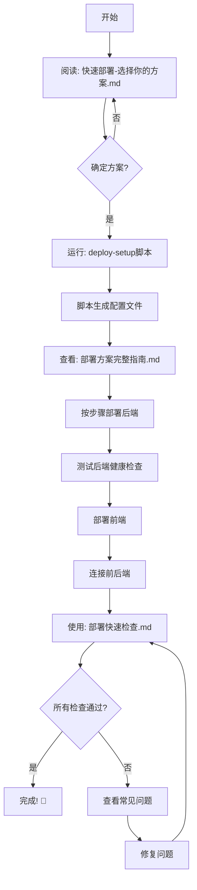

# 📚 部署资源总览

> **所有部署文档和工具的完整指南**

---

## 🎯 快速开始

### 🚀 最快部署路径

```
1. 阅读 → 快速部署-选择你的方案.md (5分钟选择方案)
2. 运行 → deploy-setup.bat (Windows) 或 deploy-setup.sh (Mac/Linux)
3. 参考 → 部署方案完整指南.md (详细步骤)
4. 检查 → 部署快速检查.md (确保完成所有步骤)
```

---

## 📖 文档指南

### 1️⃣ 快速决策文档

#### 📄 `快速部署-选择你的方案.md` ⭐ **从这里开始！**

**阅读时间：** 5分钟  
**适合人群：** 所有人  
**内容：**
- 🌳 决策树：根据你的情况选择方案
- ⚡ 5种部署方案快速预览
- 📊 方案对比表
- 💡 个性化推荐

**何时使用：**
- ✅ 第一次部署
- ✅ 不确定选哪个方案
- ✅ 想快速了解所有选项

---

### 2️⃣ 详细部署文档

#### 📄 `部署方案完整指南.md` ⭐ **最详细的指南**

**阅读时间：** 20-30分钟  
**适合人群：** 需要详细步骤的用户  
**内容：**
- 📝 5种方案的完整部署步骤
- 🔧 配置文件准备
- ❓ 常见问题解答（8个常见问题）
- 💰 成本对比详解
- 📋 部署检查清单

**何时使用：**
- ✅ 选定方案后，需要详细步骤
- ✅ 遇到问题需要排查
- ✅ 想了解配置细节

**章节导航：**
```
1. 方案1: Vercel + Render (免费)
2. 方案2: Vercel + Railway (推荐)
3. 方案3: Cloudflare + Fly.io
4. 方案4: 国内云服务
5. 方案5: Docker + VPS
6. 配置文件准备
7. 常见问题 (Q1-Q8)
```

---

#### 📄 `部署快速检查.md` ⭐ **部署时的清单**

**使用方式：** 边部署边勾选  
**适合人群：** 正在部署的用户  
**内容：**
- ✅ 部署前检查（代码、环境变量、配置文件）
- ✅ 部署步骤检查（后端、前端、连接）
- ✅ 测试检查（功能测试）
- ✅ 问题诊断（4个常见问题）

**何时使用：**
- ✅ 准备开始部署
- ✅ 部署过程中确保不遗漏步骤
- ✅ 部署后验证

---

### 3️⃣ 现有文档（已更新）

#### 📄 `VERCEL_DEPLOYMENT_GUIDE.md`

**内容：** Vercel + Render 详细指南（第三方开发者版本）  
**特点：** 非常详细，包含完整的故障排除

#### 📄 `部署到生产环境.md`

**内容：** 快速部署步骤（基于 Vercel + Render）  
**特点：** 简洁明了，适合快速上手

#### 📄 `TECHNICAL_SUMMARY.md`

**内容：** 技术总结和架构说明  
**特点：** 技术细节，适合开发者

---

## 🔧 配置文件

### 自动生成的配置文件

运行 `deploy-setup.bat` 或 `deploy-setup.sh` 后会自动生成：

| 文件 | 位置 | 用途 |
|-----|------|------|
| `.env` | `backend/.env` | 后端环境变量 |
| `.env` | `frontend/.env` | 前端环境变量 |
| `.env.example` | `backend/.env.example` | 环境变量示例 |
| `.env.example` | `frontend/.env.example` | 环境变量示例 |
| `DEPLOYMENT_INFO.md` | 项目根目录 | 部署信息记录 |

### 平台配置文件（已创建）

| 文件 | 用途 | 平台 |
|-----|------|------|
| `vercel.json` | Vercel 配置 | Vercel |
| `render.yaml` | Render 蓝图配置 | Render |
| `railway.json` | Railway 配置 | Railway |
| `backend/fly.toml` | Fly.io 配置 | Fly.io |
| `.github/workflows/deploy.yml` | GitHub Actions 自动部署 | GitHub |
| `docker-compose.yml` | Docker 编排 | Docker |

---

## 🛠️ 部署工具

### 一键配置脚本

#### Windows: `deploy-setup.bat`

**功能：**
- ✅ 检查必要工具（Git, Node.js, npm）
- ✅ 引导选择部署方案
- ✅ 收集环境变量
- ✅ 自动创建配置文件
- ✅ 安装依赖
- ✅ 生成部署报告
- ✅ 创建启动脚本

**使用方法：**
```bash
# 直接双击运行
# 或在命令行中：
deploy-setup.bat
```

#### Mac/Linux: `deploy-setup.sh`

**功能：** 同上

**使用方法：**
```bash
chmod +x deploy-setup.sh
./deploy-setup.sh
```

---

### 启动脚本

#### Windows: `start-local.bat`

**功能：** 同时启动前后端（本地开发）

**使用方法：**
```bash
start-local.bat
```

#### Mac/Linux: `start-local.sh`

**功能：** 同上

**使用方法：**
```bash
./start-local.sh
```

---

### 测试脚本

#### Windows: `test-deployment.bat`

**功能：** 测试部署是否成功

**使用方法：**
```bash
test-deployment.bat
```

#### Mac/Linux: `test-deployment.sh`

**功能：** 同上

**使用方法：**
```bash
./test-deployment.sh https://你的后端URL https://你的前端URL
```

---

## 📋 部署流程图

### 推荐的完整流程



---

## 🎯 使用场景

### 场景1: 第一次部署

**推荐路径：**
```
1. 快速部署-选择你的方案.md (选择方案)
   ↓
2. deploy-setup.bat/sh (配置环境)
   ↓
3. 部署方案完整指南.md (详细步骤)
   ↓
4. 部署快速检查.md (验证部署)
```

**预计时间：** 30-60分钟

---

### 场景2: 已经部署，遇到问题

**推荐路径：**
```
1. 部署快速检查.md → 问题诊断
   ↓
2. 部署方案完整指南.md → 常见问题 (Q1-Q8)
   ↓
3. VERCEL_DEPLOYMENT_GUIDE.md → 详细故障排除
```

---

### 场景3: 切换部署方案

**推荐路径：**
```
1. 快速部署-选择你的方案.md (重新评估)
   ↓
2. 部署方案完整指南.md (新方案的步骤)
   ↓
3. 修改配置文件
   ↓
4. 重新部署
```

---

### 场景4: 更新代码/重新部署

**推荐路径：**
```
1. 修改代码
   ↓
2. 本地测试 (start-local.bat/sh)
   ↓
3. Git 提交推送
   ↓
4. 平台自动部署
   ↓
5. test-deployment.sh (验证)
```

---

## 📊 文档对比

| 文档 | 长度 | 详细度 | 适合阶段 |
|-----|------|--------|----------|
| **快速部署-选择你的方案.md** | 短 | ⭐⭐ | 选择方案 |
| **部署方案完整指南.md** | 长 | ⭐⭐⭐⭐⭐ | 执行部署 |
| **部署快速检查.md** | 中 | ⭐⭐⭐ | 验证部署 |
| **VERCEL_DEPLOYMENT_GUIDE.md** | 长 | ⭐⭐⭐⭐⭐ | 深度参考 |
| **部署到生产环境.md** | 短 | ⭐⭐⭐ | 快速上手 |

---

## 🔗 相关资源

### 官方平台文档

- [Vercel 文档](https://vercel.com/docs)
- [Render 文档](https://render.com/docs)
- [Railway 文档](https://docs.railway.app)
- [Fly.io 文档](https://fly.io/docs)
- [Cloudflare Pages 文档](https://developers.cloudflare.com/pages)

### 本地开发

- `快速启动指南.md` - 本地开发环境搭建
- `start-local.bat/sh` - 一键启动脚本

### 技术参考

- `TECHNICAL_SUMMARY.md` - 技术架构总结
- `README.md` - 项目概览

---

## ✅ 检查清单

### 部署前

- [ ] 阅读 `快速部署-选择你的方案.md`
- [ ] 确定部署方案
- [ ] 准备 DeepSeek API Key
- [ ] 代码已推送到 GitHub

### 部署中

- [ ] 运行 `deploy-setup` 脚本
- [ ] 按照 `部署方案完整指南.md` 操作
- [ ] 配置环境变量
- [ ] 部署后端
- [ ] 部署前端
- [ ] 连接前后端

### 部署后

- [ ] 使用 `部署快速检查.md` 验证
- [ ] 测试所有功能
- [ ] 配置监控（可选）
- [ ] 保存 `DEPLOYMENT_INFO.md`

---

## 🆘 获取帮助

### 问题排查顺序

1. **检查部署清单**
   → `部署快速检查.md`

2. **查看常见问题**
   → `部署方案完整指南.md` → 常见问题

3. **详细故障排除**
   → `VERCEL_DEPLOYMENT_GUIDE.md` → 常见问题

4. **查看平台日志**
   → 在 Vercel/Render/Railway 控制台查看

5. **查阅平台文档**
   → 访问官方文档

---

## 🎉 开始部署

### 最简单的开始方式

#### Windows
```bash
# 1. 双击运行
deploy-setup.bat

# 2. 按照提示操作

# 3. 查看生成的报告
type DEPLOYMENT_INFO.md
```

#### Mac/Linux
```bash
# 1. 赋予执行权限并运行
chmod +x deploy-setup.sh
./deploy-setup.sh

# 2. 按照提示操作

# 3. 查看生成的报告
cat DEPLOYMENT_INFO.md
```

### 推荐阅读顺序

```
首次部署:
  1. 快速部署-选择你的方案.md
  2. 部署方案完整指南.md
  3. 部署快速检查.md

遇到问题:
  1. 部署快速检查.md → 问题诊断
  2. 部署方案完整指南.md → 常见问题
  3. VERCEL_DEPLOYMENT_GUIDE.md

更新代码:
  1. 本地测试
  2. Git 推送
  3. 平台自动部署
```

---

## 📝 新增文件清单

本次为您创建的所有新文件：

### 📚 文档（5个）
1. ✅ `部署方案完整指南.md` - 最详细的部署指南
2. ✅ `快速部署-选择你的方案.md` - 快速决策指南
3. ✅ `部署快速检查.md` - 部署检查清单
4. ✅ `部署资源总览.md` - 本文档
5. ✅ `DEPLOYMENT_INFO.md` - 由脚本生成

### 🔧 配置文件（5个）
1. ✅ `railway.json` - Railway 配置
2. ✅ `render.yaml` - Render 蓝图配置
3. ✅ `backend/fly.toml` - Fly.io 配置
4. ✅ `.github/workflows/deploy.yml` - GitHub Actions
5. ✅ `backend/.env` / `frontend/.env` - 由脚本生成

### 🛠️ 工具脚本（6个）
1. ✅ `deploy-setup.bat` - Windows 配置脚本
2. ✅ `deploy-setup.sh` - Mac/Linux 配置脚本
3. ✅ `start-local.bat` - Windows 启动脚本
4. ✅ `start-local.sh` - Mac/Linux 启动脚本
5. ✅ `test-deployment.bat` - Windows 测试脚本
6. ✅ `test-deployment.sh` - Mac/Linux 测试脚本

**总计：16个新文件**

---

## 🎯 总结

您现在拥有：

- ✅ **5种部署方案** 详细指南
- ✅ **完整的配置文件** 覆盖所有主流平台
- ✅ **一键部署脚本** 自动化配置过程
- ✅ **详细的文档** 从选择到部署到故障排除
- ✅ **测试工具** 验证部署成功

**无论您选择哪种方案，都有完整的支持！**

---

**开始部署吧！** 🚀

建议从这里开始：[快速部署-选择你的方案.md](快速部署-选择你的方案.md)

---

**文档版本:** 1.0  
**创建日期:** 2025-10-14  
**维护者:** Decision Assistant Team

**祝您部署顺利！** 🎉

